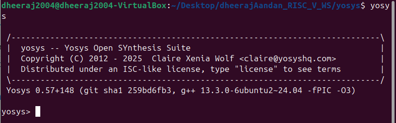
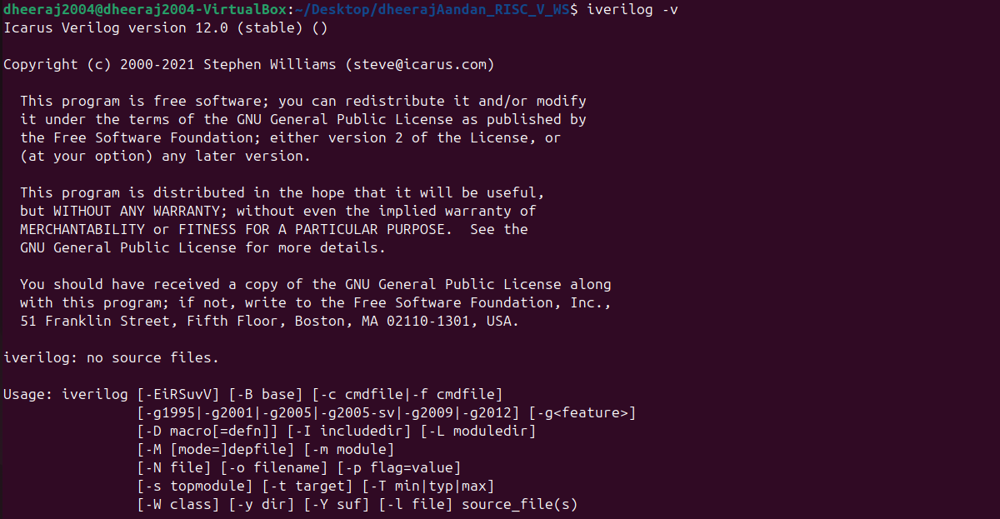
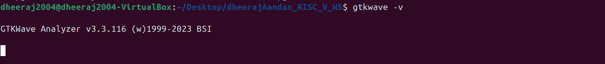

# VSD RISC V Workshop 


## Week 0 Day 0 Tasks - 

1. ### Install Oracle Virtual Machine to run Linux on a Windows OS. System requirements are as mentioned below -


* 6 GB RAM
* 50 GB HDD
* Ubuntu 20.04 or higher (Check your laptop processor specs before downloading)
* 4 vCPU


### 2\. Resize the Ubuntu window to fit monitor screen. Use commands - 


```bash
$ sudo apt update
$ sudo apt install build-essential dkms linux-headers-$(uname -r)
$ cd /media/dheeraj2004/VBox_GAs_7.2.2
$ ./autorun.sh
```


### 3\. Installing Tools - 


#### Yosys 


```bash
$ sudo apt-get update
$ git clone https://github.com/YosysHQ/yosys.git
$ cd yosys
$ sudo apt install make               # If make is not installed
$ sudo apt install build-essential clang bison flex \
   libreadline-dev gawk tcl-dev libffi-dev git \
   graphviz xdot pkg-config python3 libboost-system-dev \
   libboost-python-dev libboost-filesystem-dev zlib1g-dev
$ make config-gcc // Yosys build depends on a Git submodule called abc, which hasn't been initialized yet. You need to run the following command before running make
$ git submodule update --init --recursive
$ make 
$ sudo make install
```



#### Iverilog 

To install Iverilog use these commands - 

```bash
$ sudo apt update
$ sudo apt install iverilog
```



#### GTK Wave 

To install GTK Wave use these commands - 

```bash
$ sudo apt update 
$sudo apt install gtkwave
```




