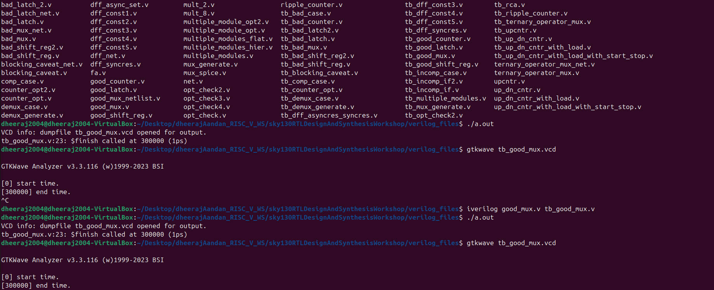
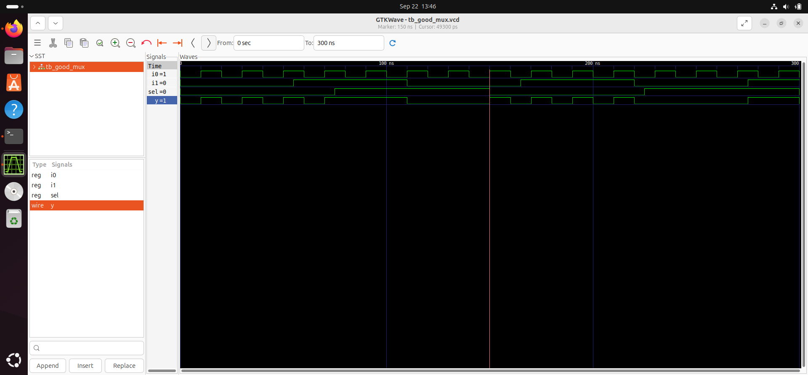
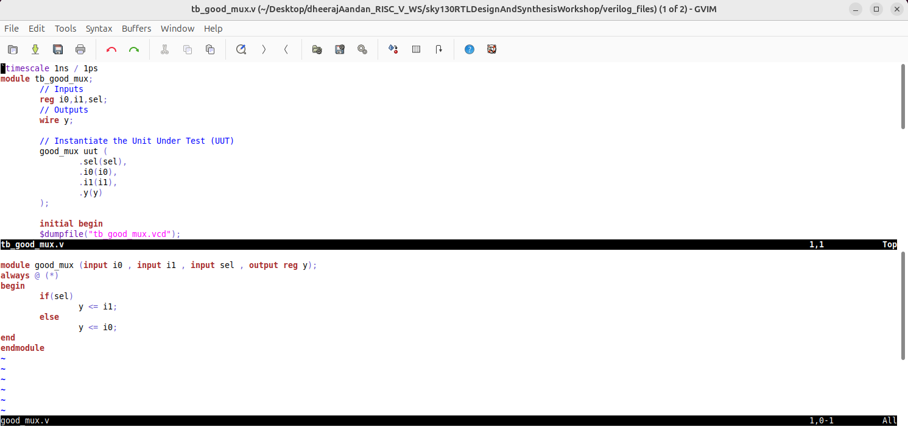
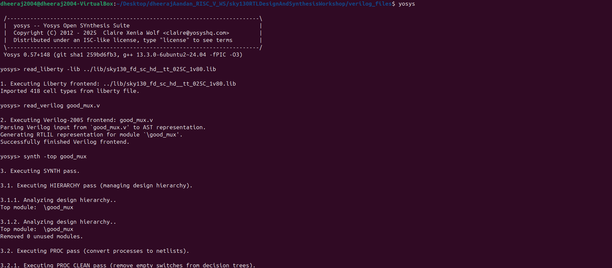

# Introduction to Iverilog, Testbench and Simulation

## 1. What is a simulator
A simulator is a software tool that mimics the behavior of hardware designs, allowing verification of digital circuits by running test scenarios without physical hardware.

## 2. What is a design and testbench
- **Design:** The actual hardware module or system described using Hardware Description Language (HDL).
- **Testbench:** A separate module that generates stimulus signals and checks outputs of the design to validate its behavior.

## 3. How does a simulator work
Simulators compile the HDL source code into an executable form and run it, emulating the digital circuit's operations and generating timing waveforms or textual outputs for verification. Only if there is a change in a the input signal, the output is evaluated.

## 4. Iverilog based simulation flow
The flow includes compiling Verilog files with `iverilog`, running the output with `vvp`, and viewing waveforms using tools like GTKWave.


## 5. Environment set up to run labs
In your working directory, clone sky130RTLDesignAndSynthesisWorkshop from GitHub repository 
```bash 
$ git clone https://github.com/kunalg123/sky130RTLDesignAndSynthesisWorkshop.git
```
Inside the /lib directory we will have our sky130 library files \
/my_lib/verilog_models contains standard cell verilog models \
/verilog_files contains the source files

## 6. Desiging a 2:1 MUX with Iverilog and GTKWave

### a) To open design and testbench in Iverilog
Use the command:
```bash
$ iverilog good_mux.v tb_good_mux.v


### b) Executing a.out file
Run the compiled simulation with:
```bash 
$ ./a.out
```


### c) Viewing waveforms using GTKWave
Generate dump files (`.vcd`) in your testbench and open them:
```bash
$ gtkwave "tb_good_mux.vcd"
```


## 7. Viewing file structure of design implemented
Organize your project files in folders such as `src/` for design and `tb/` for testbench. The structure can be viewed via your file explorer or command line. The below command opens the files on an editor.
```bash 
$ verilog_files gvim tb_good_mux.v -o good_mux.v
```



## 8. Introduction to Yosys

### a) What is a synthesizer
A synthesizer converts HDL code into a gate-level netlist suitable for hardware implementation. The tool we are using here is Yosys.

### c) What is logic synthesis
- RTL design is the behavioral representation of required specification.
- Mapping the RTL code to a digital circuit is called as synthesis.
- Code is converted to gates and connections are made between them, the output is called as netlist which is a textual representation of the gates and connections. 


## 9. What does the .lib file contain
The .lib or libery file contains a collection of logic modules \ 
Includes basic gates like AND, OR, NOT etc. \
Contains a variety of the same gate e.g. 3 input AND, 4 input AND etc. \
It may not be exhaustive and contain all logic modules, but rich enough to implement most designs

### a) Why do we need fast and slow transistors
Fast transistors are used for high-speed paths; slow transistors optimize power and reduce leakage on non-critical paths.
Capacitors are the load in digital digital logic circuits. Faster charging/discharging of capacitor leads to lesser delay.
- To charge/discharge capactors fast, we need transistors to srouce current fast.
- The transistor width plays a crucial role in sourcing current to capacitor.
- Wider the transistor, less the delay, but comes with trade-off of power and area.
- Narower the transistor, more is the delay, consumes less power and area. 

### d) Selection of cells
Cell selection balances timing, area, and power criteria based on design requirements.
The process of guiding the synthesizer to choose cells for optimum function is called contraint.
If the design has only fast cells - 
- Power and Area is the price paid
- Potential hold violation

If only slow cells are used - 
- Sluggish circuit, may not meet performance needs

## 10. Synthesizer process
The process includes reading HDL, mapping logic to standard cells, optimizing timing and area, and generating gate-level netlist.
The synthesizer does a syntactical check and then starts mapping the circuit.

## 11. Working on Yosys

### a) Invoke Yosys
```bash 
yosys
```


### b) Read liberty file
```bash
read_liberty -lib ../lib/sky130_fd_sc_hd_tt_025c_1v80.lib
```


### c) Reading design
```bash
read_verilog good_mux.v
```
Upon running this command, we should get the message "Succesfully Finished Verilog Frontend"


### d) Modules to synthesize
```bash
synth -top good_mux
```
"synth -top" is using to mention what is the module that we are going to synthesize
Syntax: synth -top module_name

### e) Convert RTL to gates
```bash
abc -liberty ../lib/sky130_fd_sc_hd_tt_025c_1v80.lib
```


### f) Showing logic that has been realized
```bash
show
```


### g) Writing netlist
```bash
write_verilog good_mux_netlist.v
```


### h) Viewing netlist
```bash
!gvim good_mux_netlist.v
```


### i) How to obtain netlist in a simpler way
```bash 
write_verilog -noattr good_mux_netlist.v
```


