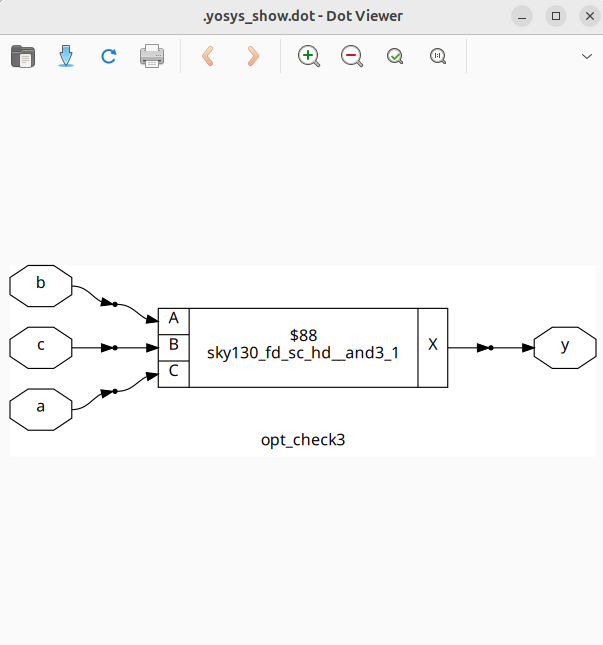
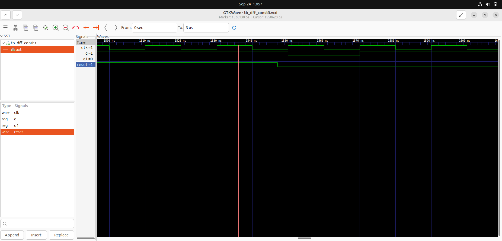
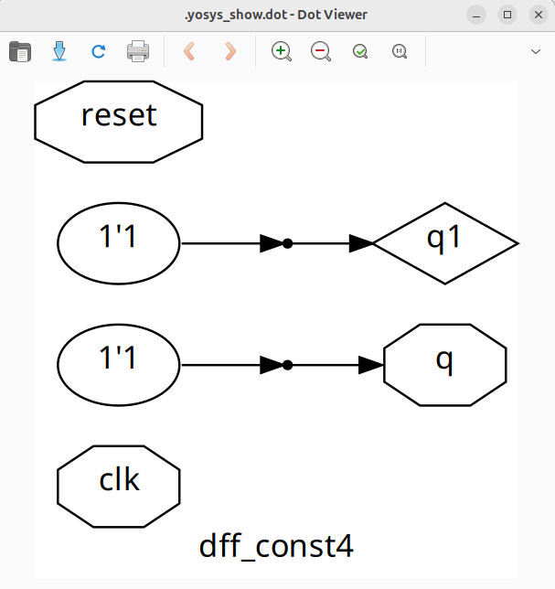
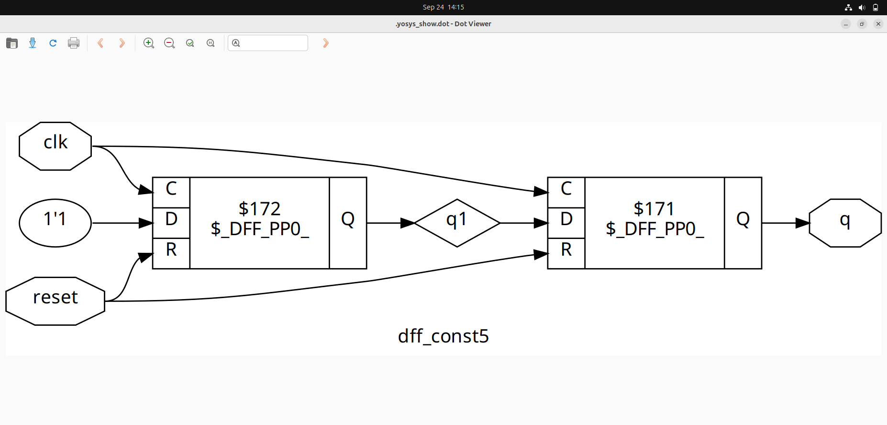
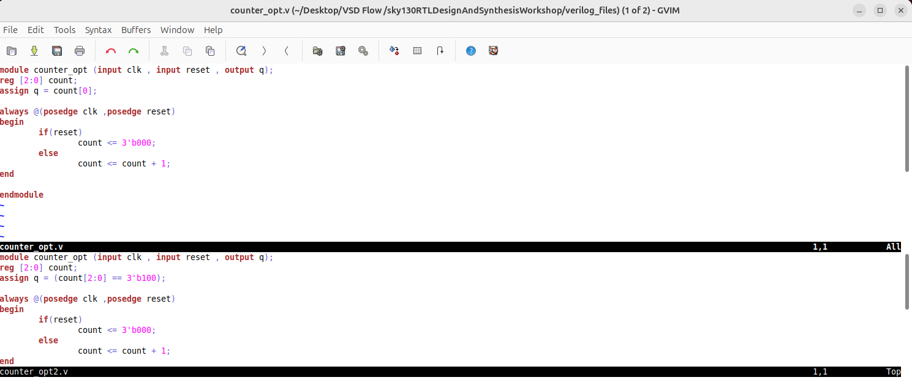

# Optimization in Digital Design
Optimization in digital design refers to the process of improving circuits to achieve better performance, lower power consumption, reduced area, and enhanced reliability. It is essential to maximize efficiency and meet design constraints.


## 1. Combinational Logic Optimization

Combinational logic optimization focuses on reducing the complexity and delays in combinational circuits by simplifying Boolean expressions, minimizing gate count, and improving timing. A few techniques used in optimizaing combinational circuits are - 

### Constant Propagation

- Constant propagation is an optimization technique where constant values assigned to signals are propagated throughout the circuit to simplify expressions.
- It eliminates logic that depends on constant inputs by directly replacing variables with their constant values, reducing gate count.
- This reduces circuit complexity and can enable further optimizations by exposing fixed logic paths.


### Boolean Logic Optimization

- Boolean logic optimization simplifies Boolean expressions using algebraic techniques to produce minimal equivalent forms.
- It reduces the number of gates and circuit levels by applying laws like combining terms, eliminating redundancies, and using Karnaugh maps or Quine-McCluskey methods.
- This optimization improves circuit speed and area by minimizing the logic needed to implement a function.

## 2. Sequential Logic Optimization

Sequential logic optimization targets the improvement of flip-flops, latches, and state machines to reduce area, power, and enhance timing by optimizing register placement and clock gating.

- **State Optimization:**  
  State optimization focuses on reducing the number of states in a finite state machine (FSM) or simplifying state encoding to minimize hardware complexity and power consumption. It improves overall efficiency by removing redundant or unreachable states.

- **Cloning:**  
  Cloning is a technique where certain logic or registers are duplicated to reduce fanout and improve timing. By replicating heavily loaded registers or paths, the circuit can achieve higher performance with reduced delay on critical signals.

- **Retiming:**  
  Retiming rearranges the placement of registers in a sequential circuit without changing its functional behavior. This technique shifts registers across combinational logic to minimize clock cycle time, reduce the number of registers, or optimize area and power.

## 3. Optimized Synthesis of Combinational Circuits

Optimized synthesis involves transforming behavioral descriptions into efficient gate-level netlists by applying technology mapping, Boolean simplification, and retiming.

Using the file with "opt" in the them under verilog_files directory, we have performed optimizaed synthesis. \
Commands to use - 

```bash
yosys
read_liiberty -lib ../lib/sky130_fd_dc_hd_tt_025C_1v80.lib
read_verilog opt_check1.v
synth -top opt_check
opt_clean -purge
abc -liberty ../lib/sky130_fd_sc_hd_tt_025C_1v80.lib
show 
```





## 4. Optimized Synthesis of Sequential Circuits


Optimization of sequential circuits during synthesis includes retiming, state minimization, and clock gating to reduce latency, power, and chip area.

```bash
yosys
read_liiberty -lib ../lib/sky130_fd_dc_hd_tt_025C_1v80.lib
read_verilog opt_check1.v
synth -top opt_check
dfflibmap -liberty ../lib/sky130_fd_Sc_hd_tt_025C_1v80.lib
abc -liberty ../lib/sky130_fd_sc_hd_tt_025C_1v80.lib
show 
```










## 5. Unused Type of Optimization
Unused optimizations refer to techniques like glitch removal, threshold voltage optimization, or technology-specific tweaks that might be overlooked but can provide additional benefits when carefully applied.\
They are an optimization technique that is imposed by the synthesizer if there are output bits that do not modify the primary output, then they are not invoked in the synthesis design 

### Examples - 

- Counter where output q = count[0]


