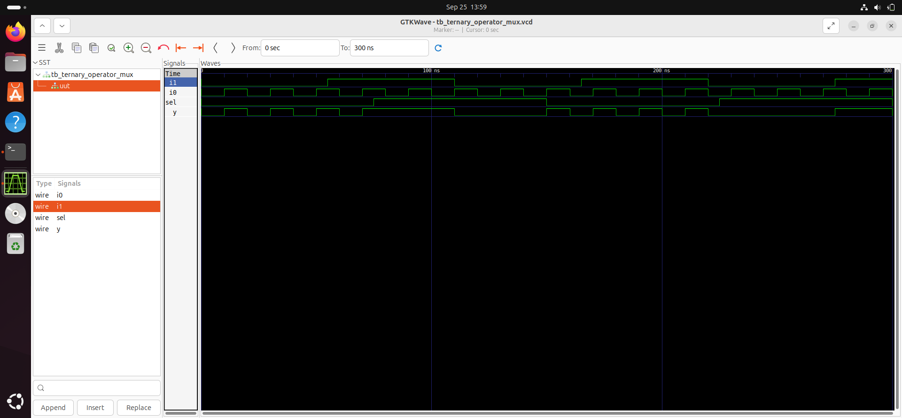
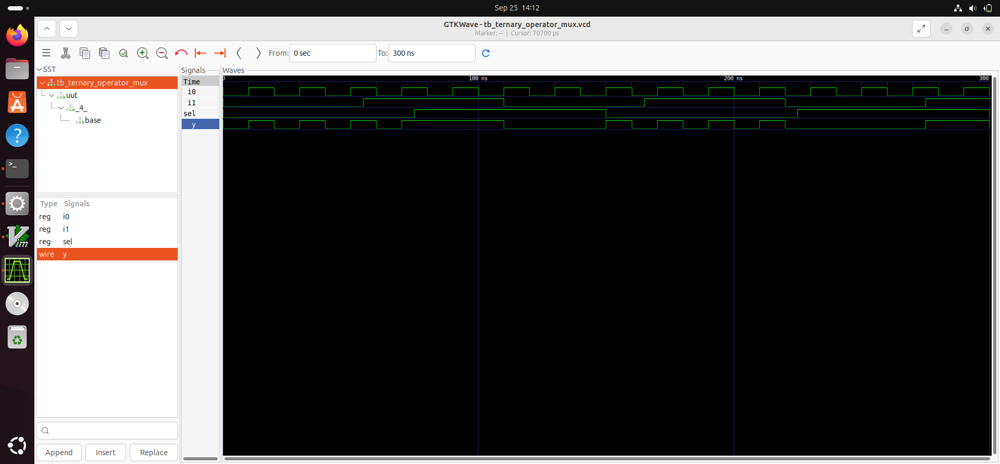
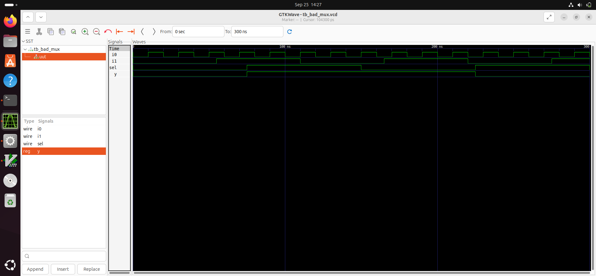
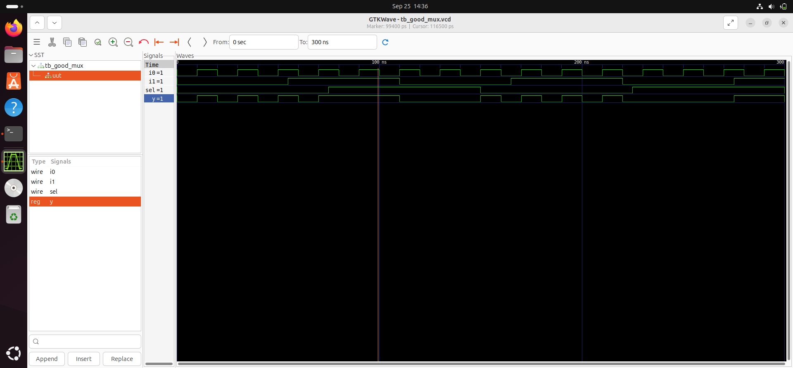
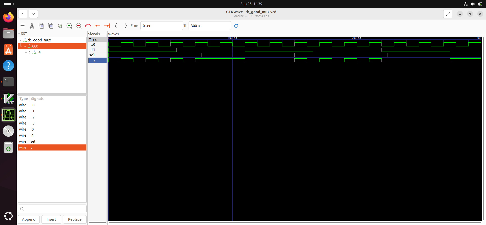
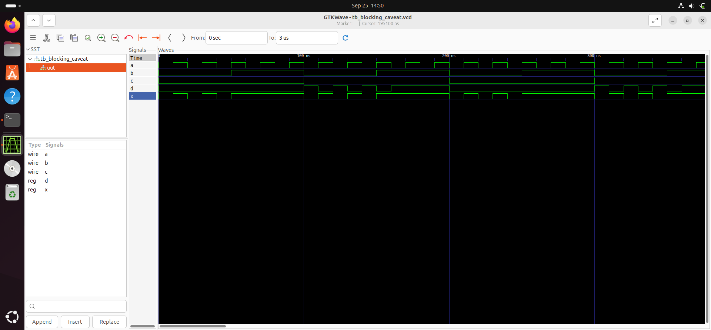
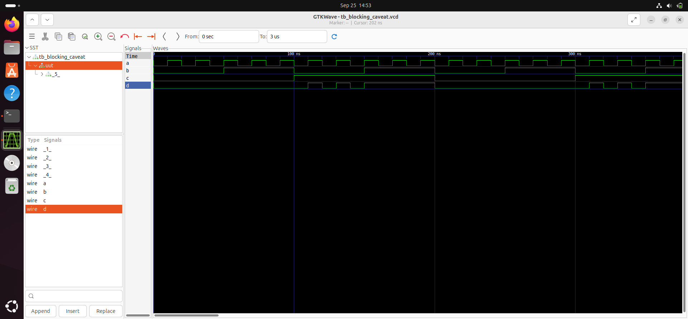

# Gate Level Simulation (GLS)

## 1. What is GLS

Gate Level Simulation is the process of simulating a synthesized netlist using a test bench, treating the netlist as the DUT (Device Under Test).  
- The netlist is logically equivalent to the original RTL code but contains technology-specific gates and connections.
- GLS verifies the functional behavior post-synthesis, ensuring physical implementation matches intended logic.

## 2. Why GLS

- GLS is performed to verify the logical correctness of the design after synthesis, catching functional discrepancies and synthesis-induced bugs.
- It checks that timing constraints are met by running simulations with delay annotation, often using SDF files for realistic timing.
- Ensures that physical characteristics (timing, initialization, test features) behave as expected before tape-out.

## 3. GLS using Iverilog


Gate level Verilog models represent synthesized designs using library-level cells.  
- Models can be **timing aware** (delays between gates modeled with delay annotations) or focused solely on **functionality** (behavior only).

## 4. Synthesis Simulation Mismatches

Simulation mismatches between RTL and gate-level can occur due to differences in event handling and coding style.

- The simulator only propagates activity when input changes; output changes may be missed if events aren’t triggered correctly.

### Causes of Mismatches

**Missing Sensitivity List**  
If the sensitivity list of an always block is incomplete, output may not update as expected. For example, in a multiplexer:\

Incorrect: missing sensitivity to 'sel'
```bash
always @(sel) begin
if (sel)
y = a;
else
y = b;
end
```

Correct: missing sensitivity to 'sel'
```bash
always @(*) begin
if (sel)
y = a;
else
y = b;
end
```


**Blocking vs Non-Blocking Statements**  
- **Blocking assignment (`=`):** Executes sequentially, can lead to incorrect simulation order.
- **Non-blocking assignment (`<=`):** Executes concurrently, ideal for sequential logic.

Blocking assignment example
```bash
always @(posedge clk)
a = b;
```


Non-blocking assignment example
```bash
always @(posedge clk)
a <= b;
```


**Non-standard Verilog Coding**  
Unusual coding styles, such as using a case statement with an ambiguous selection, may cause mismatches.

Example: case with non-standard pattern

```bash
always @(sel or a or b)
case (sel)
2'b00: y = a;
2'b1?: y = b; // Ambiguity can cause issues
default: y = 1'bx;
endcase
```

## 5. Performing GLS

**Requirements for GLS**
To perform Gate Level Simulation, you need:
- Netlist: The synthesized gate-level representation of your design.
- Verilog Models: Technology library models for the gates used in your netlist.
- Testbench: The same testbench used for RTL simulation, to apply stimulus and check outputs.

**Step 1: Simulate RTL Code and Testbench**
First, run a functional simulation of your RTL code with the testbench and view the waveform:

```bash
$ iverilog ternary_operator_mux.v tb_ternary_operator_mux.v
$ ./a.out
$ gtkwave tb_ternary_operator_mux.vcd
```
This step verifies the logic and expected behavior before synthesis.

**Step 2: Synthesize the Design**
Next, synthesize your RTL to generate the gate-level netlist:

```bash
$ yosys
read_liberty -lib ../lib/sky130fd_sc_hd_tt_1v80.lib
read_verilog ternary_operator_mux.v
synth -top ternary_operator_mux
abc -liberty ../lib/sky130_fd_sc_hd_tt_1v80.lib
write_verilog -noattr ternary_operator_mux_net.v
```
This produces a netlist (ternary_operator_mux_net.v) that describes your design in terms of standard cells.

Step 3: Perform Gate Level Simulation (GLS)
With both the netlist and the testbench ready, run GLS using the technology library models:

```bash
$ iverilog ../my_lib/verilog_models/primitives.v ../my_lib/verilog_models/sky130_fd_sc_hd.v ternary_operator_mux_net.v tb_ternary_operator_mux.v
$ ./a.out
$ gtkwave tb_ternary_operator_mux.vcd
```

This simulation checks the synthesized design's behavior and timing, using the same testbench as before.

**Step 4: Compare Waveforms**
Compare the RTL simulation waveform and the gate-level simulation waveform to identify any synthesis simulation mismatches. Differences may indicate issues such as:

- Incorrect synthesis
- Timing violations
- Coding style mismatches

Careful comparison ensures your design is both functionally and physically correct before moving to layout or tape-out.

## 6. Lab exercises
### Ternary Operator MUX GLS Simulation

- Simulation Waveform


- Gate Level Synthesis Simulation 



### Bad MUX GLS Simulation

- Simulation Waveform


- Gate Level Synthesis Simulation


### Good MUX GLS Simulation

- Simulation Waveform


- Gate Level Synthesis Simulation


### Blocking Statment GLS Simulation

- Simulation Waveform


- Gate Level Synthesis Simulation

