# If and Case Statements

This document provides examples and caveats related to conditional statements (`if`, `case`) and iteration constructs (`for`, `generate for`) in Verilog HDL.

## 1. If Statements

### Logic for If
- Represents **priority logic**.
- Example:

```bash 
if <c1>
    // code for c1
else if <c2>
    // code for c2
else if <c3>
    // code for c3
else
    // code for else condition
```


### Dangers with If – Inferred Latches
- A latch can be **unintentionally inferred** if not all conditions are covered.
- Meaning: We don’t want a latch to be present, but due to poor coding style, synthesis inserts it.

### Incomplete If-Else Statements
Example of incomplete if statement that **causes inferred latch**:

```bash 
if <c1>
    y=a;
else if <c2>
    y=b;
```


### Lab Experiment 
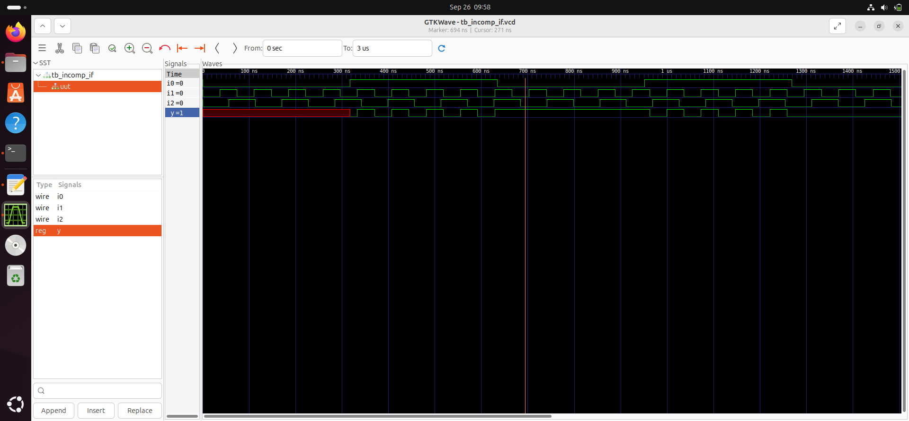
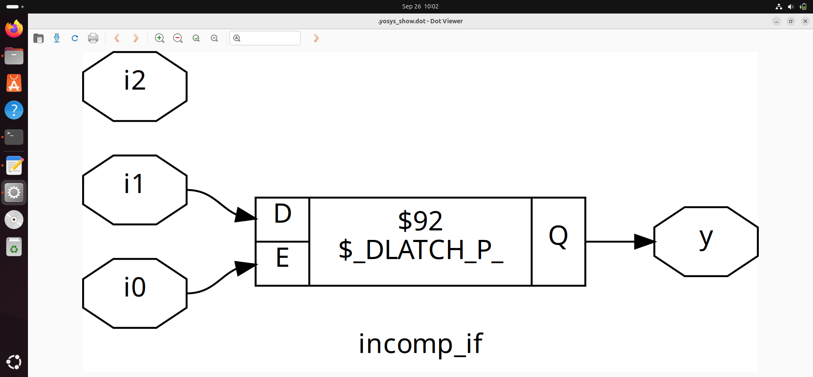

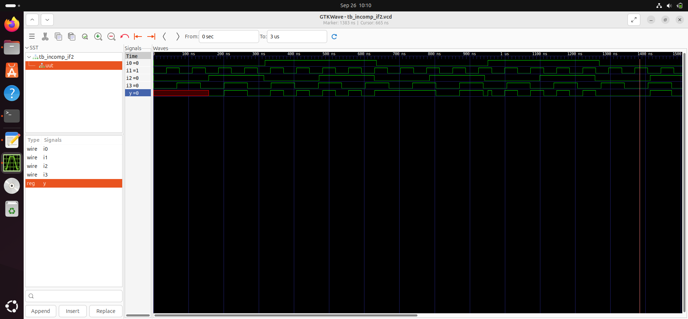

### Up-Counter Example

```bash 
module up_counter(input clk, reset,
output reg [3:0] count);
always @(posedge clk or posedge reset) 
    begin
        if (reset)
            count <= 4'b0000;
        else
            count <= count + 1;
    end
endmodule
```


---

## 2. Case Statements

### Caveat 1 – Incomplete Case (4:1 Mux)

- Missing branches can also infer a **latch**.
```bash 
always @(*) 
    begin
        case(sel)
        2'b00: y = d;
        2'b01: y = d;
        2'b10: y = d;
        // Missing default or 2'b11 → latch inferred!
        endcase 
    end
```

**Lab Experiment:**
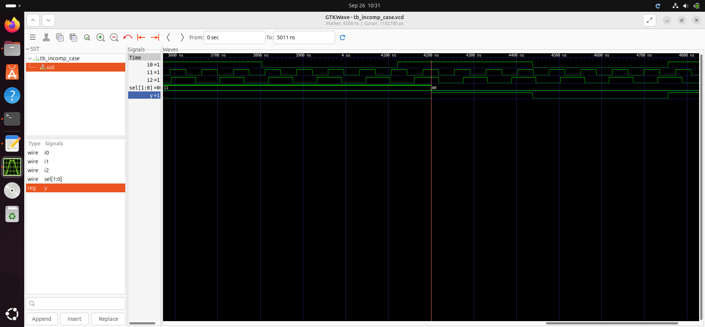
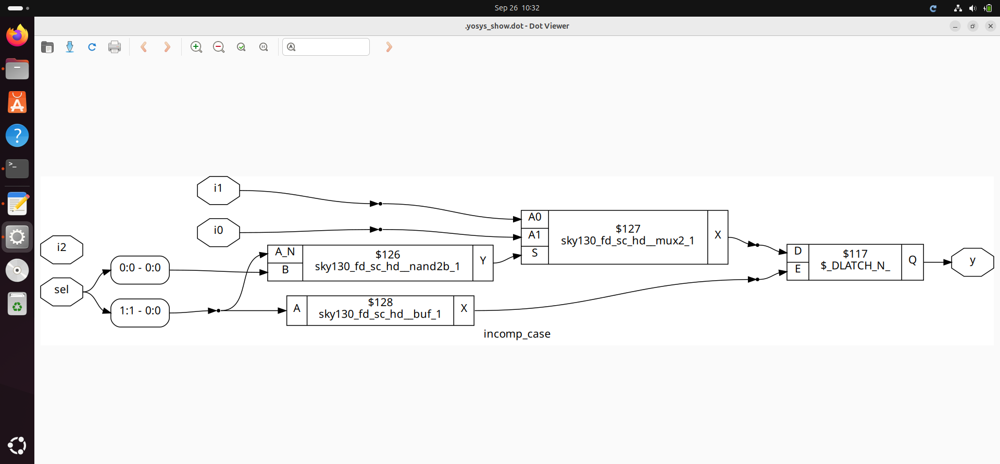
### Caveat 2 – Partial Assignment

Two outputs with incomplete assignment:
```bash
always @(*) 
    begin
        case(sel)
            2'b00: x = a; // y not assigned → latch on y
            2'b01: y = b; // x not assigned → latch on x
            default: begin
            x = 0;
            y = 0;
            end
        endcase
    end
```

**Lab Experiment:** 
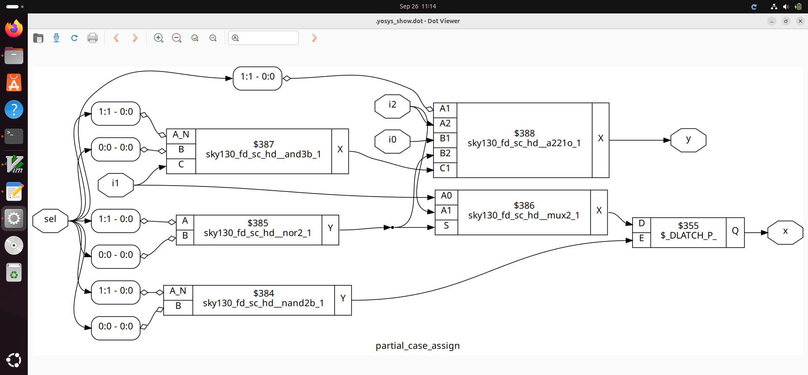


### Caveat 3 – Overlapping Case (Bad Coding)
```bash 
always @(*) 
    begin
        case(sel)
        2'b00: y = d;
        2'b01: y = d;
        2'b10: y = d;
        2'b1?: y = d;
        endcase
    end
```

- Problem: `2’b1?` **overlaps** with `2’b10` and `2’b11`.  
- Tools may give priority differently, making results unpredictable.  
- **Better approach:** Use `if-else` with proper priority or avoid overlapping case items.

**Lab Experiment:** 
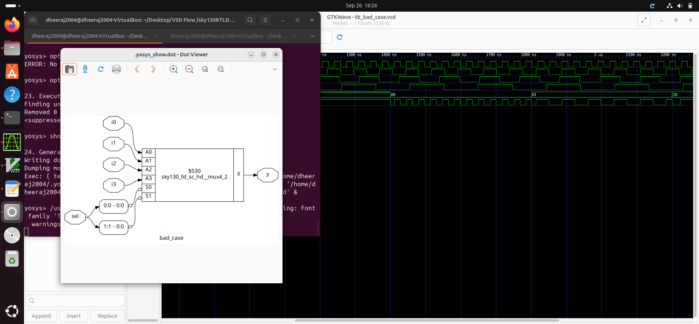


## 3. For Loop

- Used **inside always block**.
- Useful for repetitive evaluation logic such as Mux/DeMux.

### Example: Wide MUX
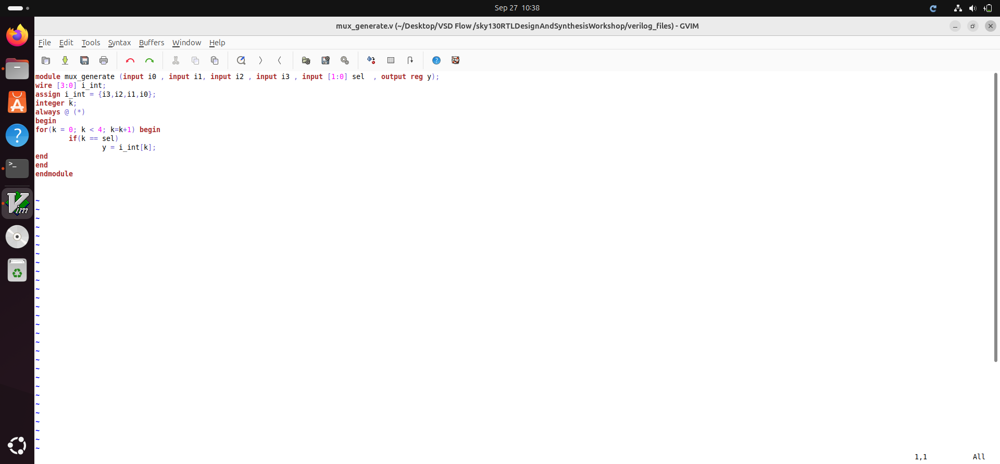

**Lab Experiment:** 
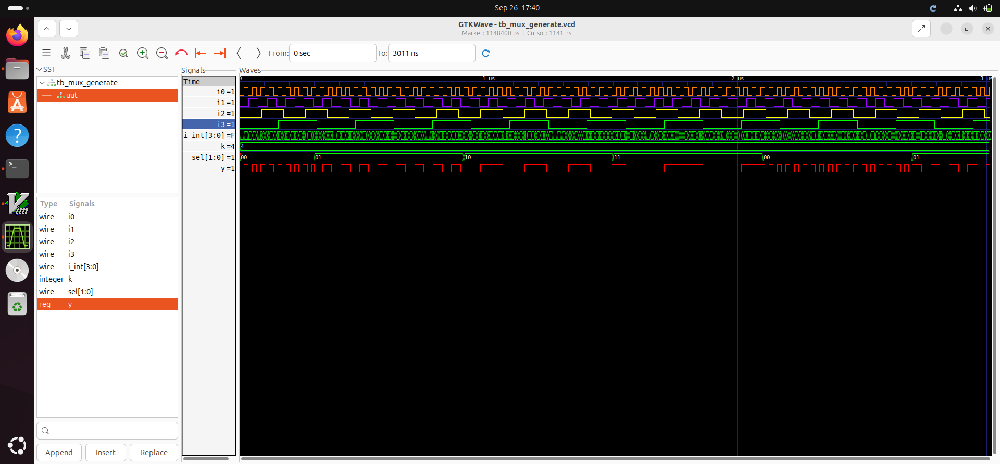
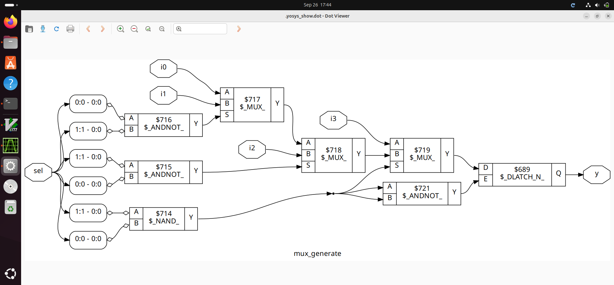
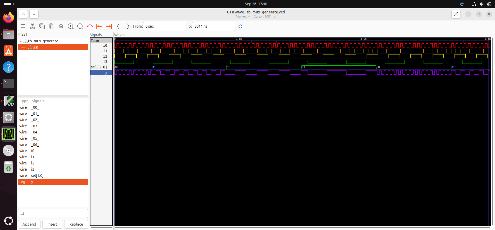

## 4. Generate For Loop

- Used **outside the always block**.
- Mainly for **structural instantiation** of multiple modules.

### Example: Ripple Carry Adder using Full Adder
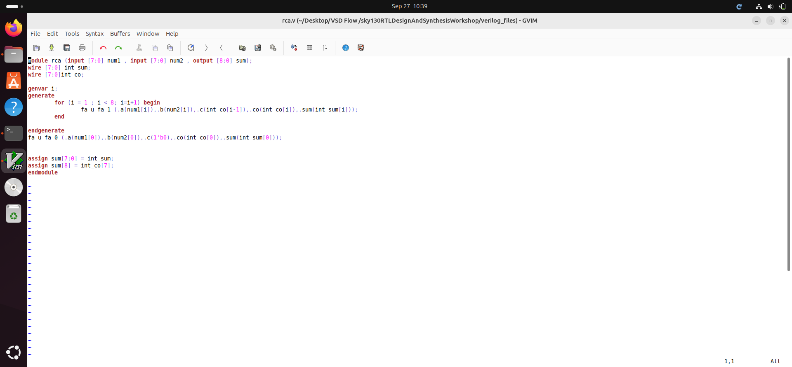
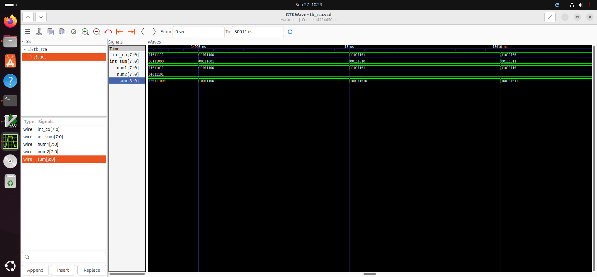
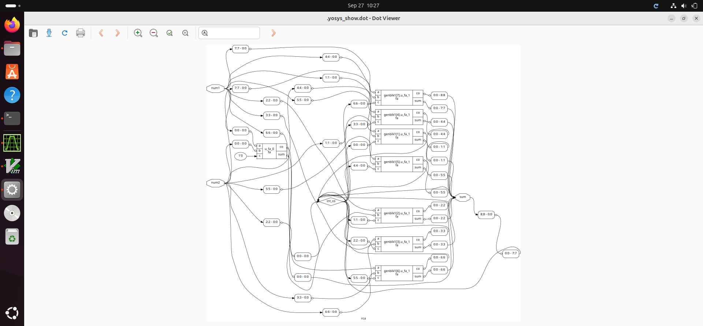
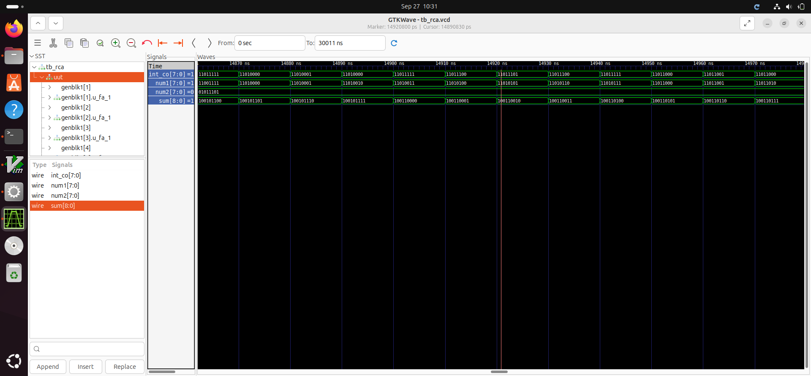


