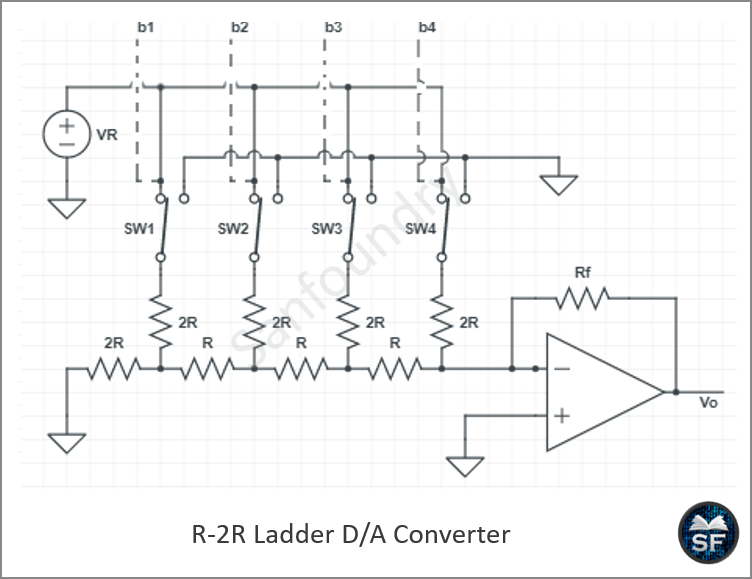
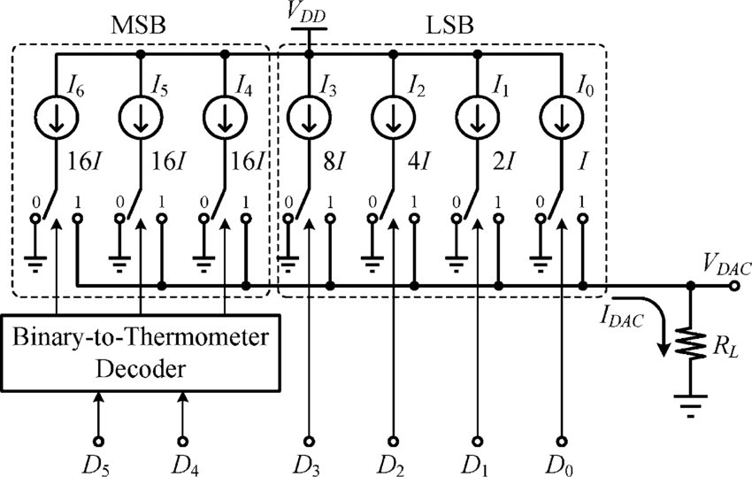

This week is more about research on SoC, mainly the open-source SoC design that contains a RVMYTH processor, a RISC V based processor. The SoC comes with an integration of a Phase Locked Loop (PLL) for accurate clock generation and control along with a 10-bit Digital to Analog Convertor so that the SoC can communicate with other peripheral devices that take in analog inputs such as radars, weather monitor systems, and give output in the form of audio or video. 

# 1. What is a System on a Chip (SoC)
A SoC is like a mini-computer that works on a single chip, instead of designing and manufacturing separate parts for each function. This is done mainly for applications where power, performance and area (PPA) are really crucial such as smartphone, tablets etc. 

### Key Parts of an SoC 
#### a) CPU (Central Processing Unit)
- The brain of the SoC that handles all instructions and decision making.

#### b) Memory
- RAM is a volatile memory whose data is lost once it loses power.
- ROM is a non-volatile memory whose data is stored even when power is lost. 

#### c) I/O Ports
- Used as means of communication between the SoC and external peripheral units.
- Connects the SoC to devices like USB, Camera, Microphone,etc. 

#### d) GPU 
- Used for creating visuals. 
- Main applications include gaming, video editing, AI & ML computaions, Medical Imaging.

#### e) Digital Signal Processor (DSP)
- Responsible for processing audio and video signals.
- used for applications like noise cancellation, sound enhancement, equalization.

#### f) Power Management 
- The SoC should be able to regulate power and make sure that it operates efficiently. 
- This is a major factor in wearable devices as battery life is important. 

#### g) Additional Features
- Functionalities such as WiFi, Bluetooth, Devcie to Device Communication can be coded onto the chip based on application and need. 

### Examples of an SoC 
a) Qualcomm SnapDragon - Used in mobile phones and laptops.\
b) Apple A17 Bionic - Powers iphones.\
c) Samsung Exynos - Used in Samsung Phones.

### Advantages of using a SoC
#### a) Compactness
Since all components are integrated onto a single chip, the size of the device reduces drastically and is more portable. 

#### b) Energy Efficient 
Since the different modules of a SoC are so close together, which drastically reduces the need for power hungry enternal communication between seperate chips

#### c) High Performance 
Data travel path is short, making transfer speeds really high. 

#### d) Cost Effective
Builing and assembling of seperate chips is costly and a time consuming process. Whereas integrating all modules into one chip is cost and time saving.

### Challenges with SoC 
A few main challenges that the industry currently faces while manufacturing SoCs are - 
- Complex Design: Integrating all modules onto a single chip is a conplex process and require highly trained and skilled professionals. 

- Overheating Problems: Since all the parts are close to each other, the heat distribution is poor and results in overheating. Efficient cooling mechanisms need to be inferred so as to make the SoC last longer. 

# VSD Baby SoC
The Baby SoC contains mainly 3 components,
- RVMYTH processor: Based the open source RISC V processor, a simple CPU that can be customized based on application and handles instruction proccessing and decision making and communicates with other parts of the SoC making the RVMYTH processor ideal for learning 

- Phase Locked Loop: An electronics circuit that is mainly used for continuous clock generation and keeps all components in the SoC running in sync. Matches the SoC's clock with a reference frequency that ensures proper timing for the RVMYTH and DAC. 

- Digital to Analog Converter: The main purpose of this device is to convert digital signals from the RVMYTH to analog output like sound, temperatureor video. 

# Phase Locked Loop
A Phase-Locked Loop (PLL) is an electronic control system that synchronizes the phase and frequency of its output signal to a reference input signal using feedback mechanisms. It continually adjusts its output so that it remains "locked" in phase and frequency with the input.

### Functionality
- The PLL compares the phase and frequency of its output signal with the input reference.
- If there is a difference, it generates a correction signal to adjust the output and minimize this error.
- Once locked, it maintains a stable relationship between the output and input frequencies, allowing the system to recover, multiply, or generate precise frequencies.

**Type 1 PLL**
.png)

**Type 2 PLL**
.png)

### Key Components 
- Phase Detector (PD) / Phase-Frequency Detector (PFD): Compares the input and output signal phases and outputs an error signal.
- Charge Pump (for some types): Converts phase difference into current or voltage.
- Loop Filter (Low Pass Filter): Smooths the error signal, filtering out high-frequency noise.
- Voltage-Controlled Oscillator (VCO): Generates the output signal, whose frequency is controlled by the loop filter output.
- Frequency Divider: Used in the feedback path for frequency synthesis applications, allowing output frequency to be a multiple of the reference.

### Applications 
- Clock generation and synchronization in microprocessors and digital circuits.
- Frequency synthesis (generating multiple frequencies from a single base frequency).
- Demodulation in radio and communication systems (FM, FSK demodulators).
- Clock and data recovery in serial communication links (USB, Ethernet).
- Audio and video signal processing, jitter reduction in high-speed data links.
- Wireless communication, radar, and signal conditioning systems.

# Digital to Analog Converter 
A DAC is an electronics circuit that converts digital signals to analog signals so that they can tranfer data to devices like cameras, screens, speakers or any device whose output is continuous.

### Key Components
- Reference Voltage: Sets the maximum output voltage level.
- Resistor Network / Current Sources: Implements the conversion from digital code to analog value, common in types like weighted-resistor DACs and R-2R ladder DACs.
- Switches: Controlled by digital inputs to select how much reference voltage is applied to the output.
- Output Buffer/Amplifier: Provides current drive and isolates the DAC circuitry from external circuits.
- DACs are usually integrated in metal-oxide-semiconductor (MOS) chips for compactness and precision.

### Types of DAC 
There are mainly three types of DACs:

- R-2R Ladder DAC

- Current Steering DAC

- CHarge Scaling DAC

# Why functional modelling is important 
Functional modeling is performed before RTL and physical design stages to create a clear, high-level representation of the system's intended functionality. This step ensures that the system's operations and data transformations are well understood and correctly defined.\

###Importance of Functional Modeling Before RTL and Physical Design
- Functional modeling captures what the system should do, focusing on behavior and data flow without getting into circuit or hardware specifics. This clarifies requirements and logic.
- It enables early validation and detection of design errors or inconsistencies before costly detailed design steps, helping avoid rework in RTL coding or layout.
- By providing an abstracted blueprint of system operations, it facilitates communication among designers, engineers, and stakeholders, ensuring common understanding.
- Functional modeling breaks down complex systems into manageable functions and processes, supporting systematic development and verification planning.
- This step supports optimization decisions by exposing critical functions and data dependencies, guiding efficient RTL and physical design choices later