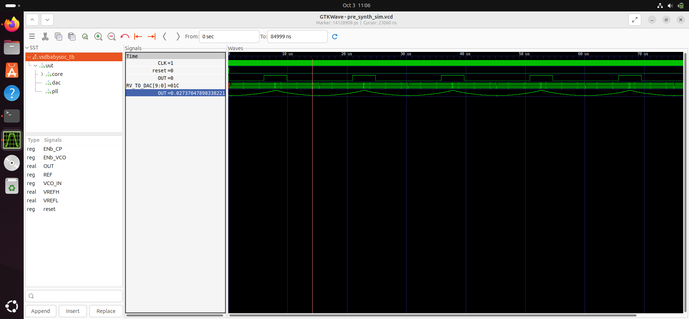
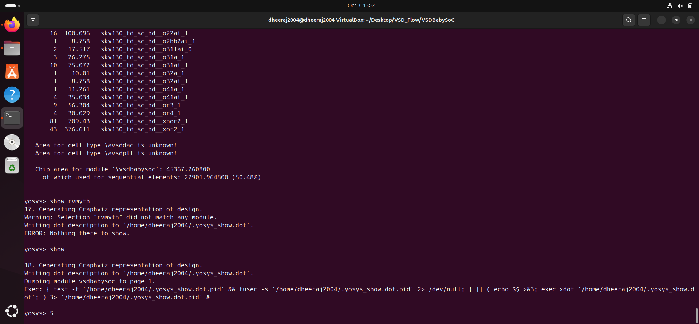
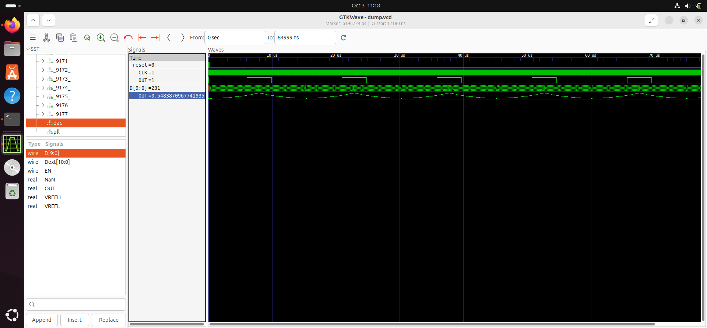

# VSD Baby SoC 
This document provides detailed steps for pre-synthesis and post-synthesis simulation of the VSD Baby SoC that contains a `RVMYTH` RISCV processor, two analog IPs `10-bit DAC` and `PLL`, using opensource tools including `iverilog`, `gtkwave` for simulation and `yosys` for synthesis.

## Prerequisists 
- Make sure your have iverilog and gtkwave installed in your system 
- To convert .tlv file to .v file make sure you are in a virtual environment and use the following commands

```bash 
pip3 install pyyaml click sandpiper-saas
sandpiper-saas -i ./src/module/*.tlv -o rvmyth.v --bestsv --noline -p verilog --outdir ./src/module/
```

- This is done because the rvmyth.v file is present in the rvmyth.tlv file and is generated by Sandpiper. This file is crucial as it is used in both simulation and synthesis steps.

## 1. Pre-Synthesis Simulation 

- To preform compilation of your `rvmyth.v` file and its testbench `testbench.v` use the following command - 

```bash 
iverilog -o output/pre_synth_sim/pre_synth_sim.out -DPRE_SYNTH_SIM src/module/testbench.v -I src/include -I src/module
```
- To view the simulation result using gtkwave, use - 

```bash 
cd simulation
./pre_synth_sim.out
gtkwave pre_synth_sim.vcd
```

- Upon successful compilation and and execution, the result obtained is as below. This shows that the RVMYTH processor produces the required analog output, ensuring that the SoC design has proper working before synthesis.


## 2. Synthesis Flow

- Inorder to perfom synthesis we are using Yosys Open Suite tool. 

- Stub files are used for the analog IPs as the synthesis tools cannot build them with digital gates. They are empty verilog modules that only specify the I/O ports of the IP block without trying to synthesize the entire verilog file 
    - avsddac_stub.v 
    ```bash 
    module avsddac (
        output OUT,
        input [9:0] D,
        input VREFH,
        input VREFL
    );

    // Intentionally empty

    endmodule
    ```
    - avsdpll_stub.v 
    ```bash
    module avsdpll (
        output reg  CLK,
        input  wire VCO_IN,
        input  wire ENb_CP,
        input  wire ENb_VCO,
        input  wire REF
    );

    // Intentionally empty

   endmodule
   ```
- The inputs required for synthesis are - 
    - `vsdbabysoc.v` src file
    - `rvmyth.v` src file
    - `avsddac_stub.v` black box file
    - `avsdpll_stub.v` black box file
    - `.lib` technology file

## 3. Commands performed inside yosys

These are the commands used used inside the yosys environment to synthesize our SoC - 

```bash 
read_liberty -lib src/lib/sky130_fd_sc_hd__tt_025C_1v80.lib
read_liberty -lib src/lib/avsddac.lib
read_liberty -lib src/lib/avsdpll.lib
read_verilog src/module/vsdbabysoc.v
read_verilog -I src/include src/module/rvmyth.v
read_verilog -I src/include src/module/clk_gate.v
read_verilog src/module/avsddac_stub.v
read_verilog src/module/avsdpll_stub.v
synth -top vsdbabysoc
dfflibmap -liberty src/lib/sky130_fd_sc_hd__tt_025C_1v80.lib
opt
abc -liberty src/lib/sky130_fd_sc_hd__tt_025C_1v80.lib
flatten
setundef -zero
clean -purge
rename -enumerate
write_verilog -noattr reports/vsdbabysoc_netlist.v
stat -liberty src/lib/sky130_fd_sc_hd__tt_025C_1v80.lib
show vsdbabysoc
```

## 4. Errors that may arise 

### Missing include file

```bash 
ERROR: Can't open include file 'sp_verilog.vh /*_\SV */'!
```

- Cause: The rvmyth core uses include directives to import Verilog header files (.vh). Yosys was not aware of the src/include/ directory where these files are located.
- Resolution: Add the -I src/include flag to required read_verilog commands in the Yosys script. This tells Yosys to add that directory to its search path for header file.

### Missing function 

```bash 
ERROR: Missing function on output GCLK of cell sky130_fd_sc_hd__dlclkp_1.
```

- Cause: Standard cell libraries (Liberty .lib files) should define the Boolean function for each output in each cell. Cells that are pure clock gates, level shifters, or similar, often lack such a function, since the output is not a simple combinational Boolean function Yosys expects every output port to have a function (even if it's just a buffer or a pass-through).
- Resolution: If you do not need this cell's internal function for your synthesis, you can blackbox it. In your synthesis script, before reading the liberty file, add:

```bash 
blackbox sky130_fd_sc_hd__dlclkp_1
```

This will treat the cell as a black box, allowing synthesis to proceed.

### Unexpected Token 

```bash 
src/module/avsddac.v:14: ERROR: syntax error, unexpected TOK_REAL
```

- Cause: Incorrect use of the real data type with reg and wire in Verilog-2005. The standard Verilog-2005 does not allow declaring signals as reg real or wire real, nor can you use real in ports directly.
- Resolution: Remove the `real` keyword while declaring `avsddac_stub` and `avsdpll_stub` modules.

## 5. Synthesis Results 

Upon successful synthesis by yosys, we can generate the report of the SoC module 



## 6. Post Synthesis Simulation 

- GLS is carried out to verify if the design upon synthesis works exactly the same as it did before synthesis. This is done by simulation the generated netlist with the testbench of the design. 
- For compilation of netlist and testbench files use - 
```bash 
 iverilog -DFUNCTIONAL -DUNIT_DELAY=#1 -o output/post_synth_sim/post_synth_sim.out src/gls_model/primitives.v src/gls_model/sky130_fd_sc_hd.v reports/vsdbabysoc_netlist.v src/module/avsdpll.v src/module/avsddac.v src/module/testbench.v
```

- For execution of the compiled files 
```bash 
cd simulation
./post_synth_sim.out
gtkwave dump.vcd
```

- Upon successful simulation we get another output waveform 


Comparing the above waveform with the pre-synthesis simulation output, we can confirm that the design's functionality has not changed after synthesis 


